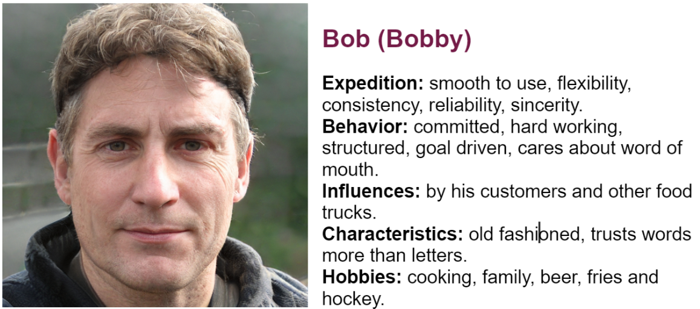
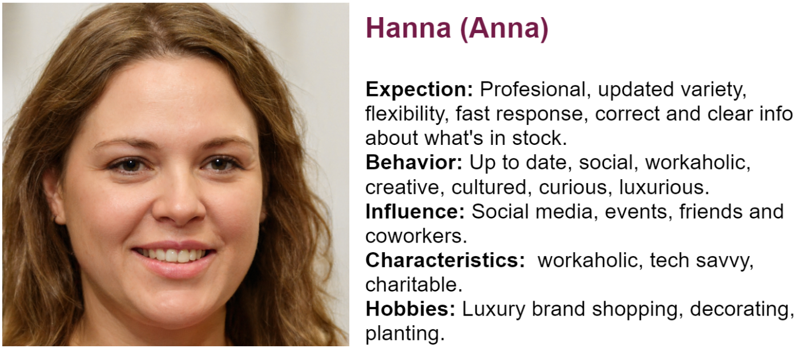

## Users Interview Answers

**Males of ages 31, 36, 37 and 28**

1. What is the first thing you notice when you visit this site?
 - Bad font , hard to read, poor contrast.

2. Why did you visit this site?
 - I went into the website to order products for my restaurant. To do testing on the website for a school project. 

3. Would you trust to order from this website? why?
 - I trust the website because of the small business and security lock. I do not trust the website because it is not clear , not usable, unacceptable, I don’t understand the languages, I wanted English or Swedish. Poor design feels unprofessional. Feels fake and messy. 

4. Is it easy to navigate and order? why?
 - No, I didn't like that I had to zoom in to use the website, confusing and it’s not clear where I have to go to order. No, the language was even harder to understand and the pictures were confusing. 
 - Yes, it’s easy to use like that the member list was searchable and put your postcode.

5. How often do you visit websites to order culinary foods?
 - Not very often, or first or never, monthly.

6.  Do you feel something is missing?
 - Clear layout, shopping cart, info on delivery, safety, simple and professional feel. Wanted an extra order buttons need to be visible and smooth as possible, menu and prices list, contacts, members and cooperators, search service on the site, clear payment method with secure solution. 

7. Do you know who to contact and how?
 - No, not sure if contacts really work, the service and prices were unclear. 
 - Yes, it is very clear , the information needed is their email , phone number and name of company. Yes, the contact page is clear.

8. What did you not like about the website?
 - The pictures were disappointing because they could not click, not accessible, design issue, color scheme not consistent, no option for eng, usability and readability issue, amature, cheap site, didn’t like the red lines. shopping cart, how to order and where to go is missing and not easy to follow. 

9. What do you look for when you order online?
 - Good prices and trusted services, Need to know clear delivery instructions, check if there are any pictures from previous events or successful jobs done, inviting photos, menu suggestions, check the certificate if not sure. 

10. Do you understand the service provided?
 - Kindoff it’s wholesale for catering companies, No i think it’s a restaurant, maybe, yes it’s a grosist. 

**Female of ages 22, 27 and 36**

1. What was your first impression? 
 - Shocked, and then like the picture, overwhelmed by color and stuff, felt like the login thing was good and the lang flag was nide sidebar menu was clear, The Photos are to basic connected to each other. 

2. Do you feel the website is trustworthy?
 - No, unprofessional and not well prepared in design, many things happen and didn’t like the news and ads feels untrustworthy.
 - Yes clear contacts and made me trust the site.

3. Do you understand what the company does?
 - It’s catering.

4. Does the website feel easy to use and navigate?
 - Easy because it’s divided into sections, navigation and left hand bar clear, some links demanded login but you didn't know until you press it, no international language.

5. What is most important to you when it comes to making an online purchase?
 - Reliability and credibility of the website, the site should be up to date and it wasn’t . less text and clear less picture and make it clear what they need to deliver. 

6. Do you feel like you can find all the information you need to find your nearest wholesaler?
 - No,

7. Do you know how to contact the company for questions or other matters?
 - Yes there is mail and contact me. 

8. What are you looking for / what is important to you when using a website like this?
 - Qualified and reliable for ordering, successful restaurant from diverse cuisine, easy to understand and language.

9. Are you missing something on the website? What?
 - Creativty and composition are missing, the ability to change lang, ability to login, search function would be useful, less text and colors and more clarity, trustworthiness. 

## Persona creation process

**Persona 1**

 - Gender: Male 
- Age: 36 
- Profession: Food Truck owner 
- Name: Bob
- Family: 2 kids and partner

  - Bob lives a hectic life, working double shifts and weekends, loves structure, and likes to be challenged.
His food truck business is getting popular and he wants to spread all over the land. Bob likes to get his food from trusted sources and therefore he wants to use a service where he can trust that they use the best produce and have the customer's best interest. He doesn’t like to be a member at different companies for different services, he likes things to be done right , fast , and efficiently. He likes to spend time with his family but he can’t at the moment because he is taking care of everything. He is very handy and creative however he is not the best when it comes to using the internet. Bob’s goal is to have a Michelin star restaurant! And be close to his family. 

**Persona 2**

- Gender: Female
- Age: 29
- Profession: Event planner
- Name: Hanna
- Family: Single

  - Hanna is career driven. Her goals are to own a castle where she can host events at. She has a time plan to achieve this goal. She lives in the city and travels frequently to plan her events. Has care for details and likes to do a good job. She is social and likes meeting new people and does her own marketing in social media. She lives a hectic but happy life, working 24/7. She had a recent promotion where she has more authority to make creative decisions. She doesn't believe in having limits, she dreams and aims big. Always wanting to do bigger and better things than before. Hanna's events usually have different themes and needs so she needs a good company that provides a diverse and trusted service. 

## Persona Cards

## User Stories
https://github.com/orgs/chas-academy/projects/44/views/1
 
